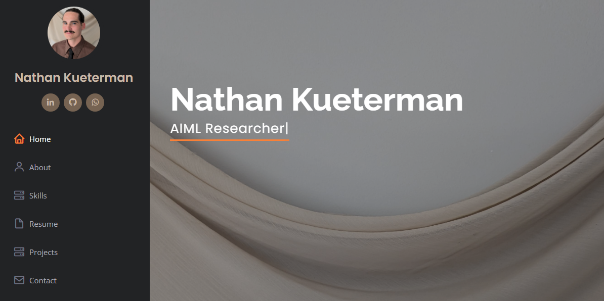

#
# My Personal Portfilio Website (Django)

Personal portfolio website made with Django framework in the backend, and with CSS, JS, and Bootstrap for the frontend.


## Screenshots




## 🔗 Links
[](https://www.linkedin.com/in/the-real-nathan-kueterman/)


## Tech Stack

**Client:** Html, css, Bootstrap

**Server:** Python, Django, Render


## Run Locally

Clone the project

```bash
  git clone https://github.com/nkueterman/django-portfolio-website.git
```

Go to the project directory

```bash
  cd django-portfolio-website
```

MAKE  Migration

```bash
  python manage.py makemigrations
```

MAKE  Migration

```bash
  python manage.py migrate     
```
Start the server

```bash
  python manage.py runserver     
```


## Authors

- [@Nathan Kueterman](https://github.com/nkueterman)

